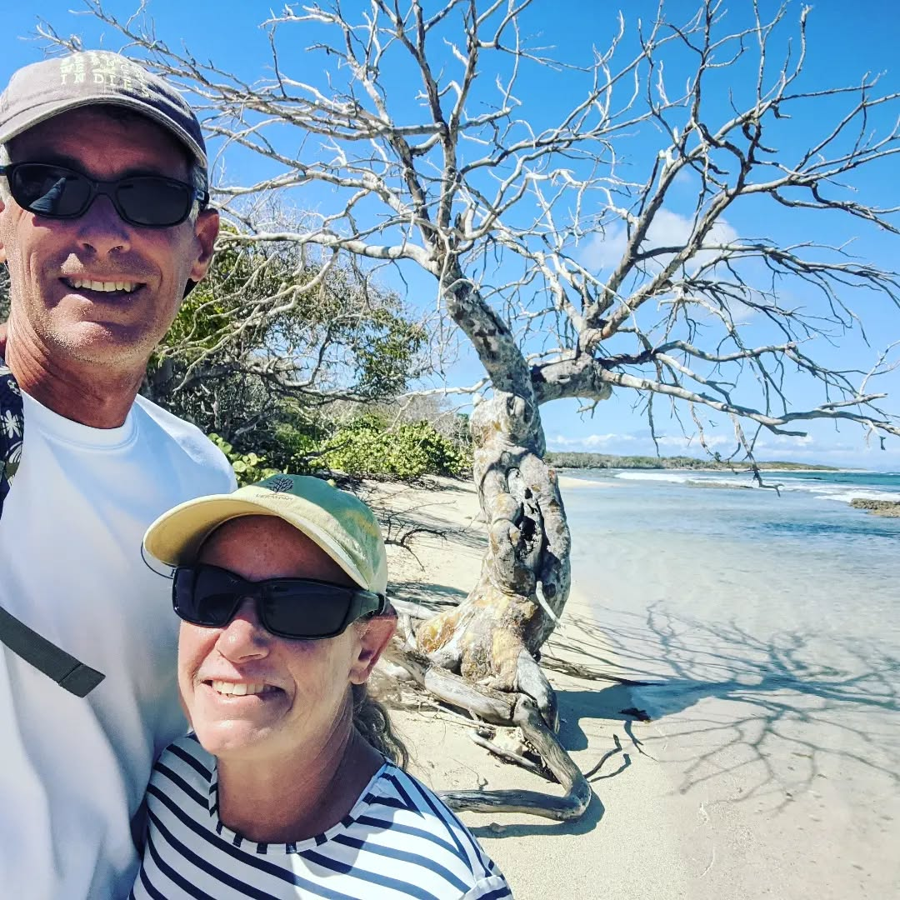
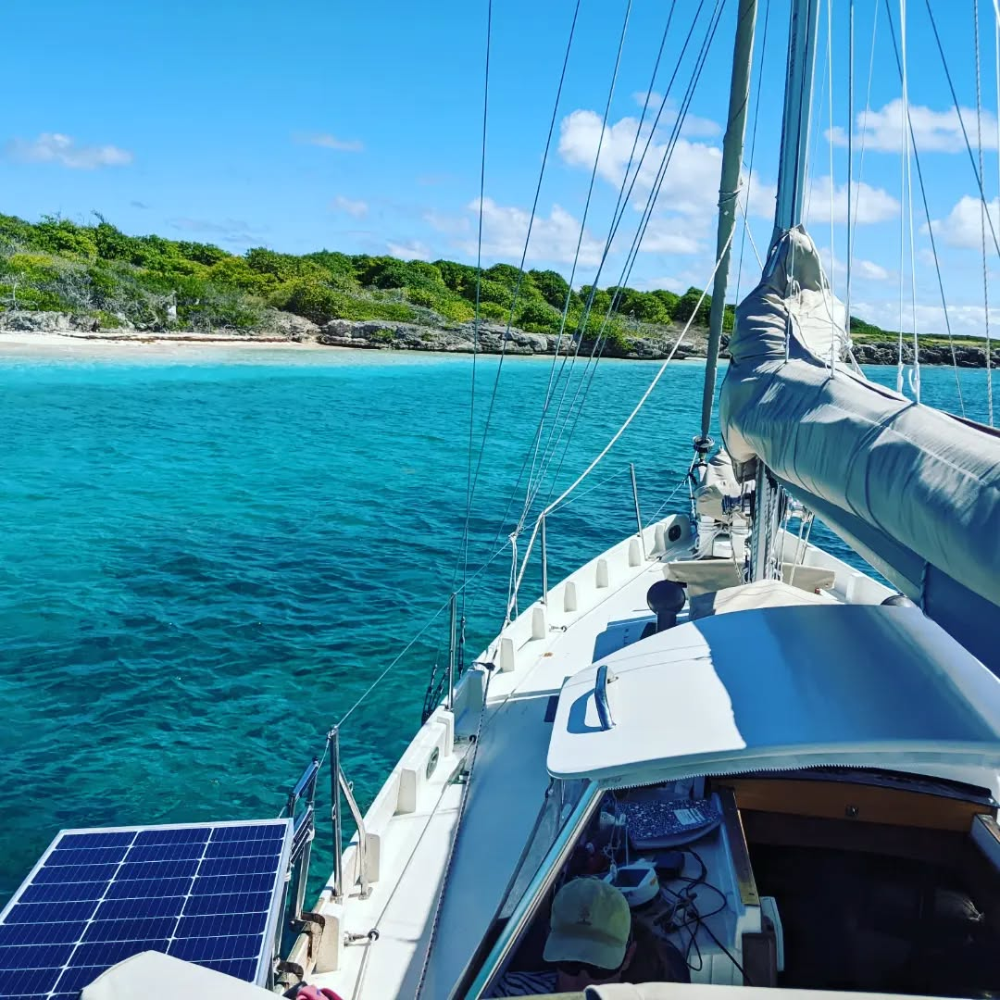
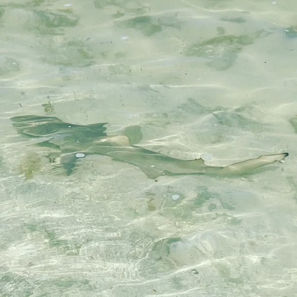

Calypso at Petite Terre, Guadaloupe. Iguanas, baby lemon sharks, BIG 'cuda, about a 100 of your best buddies showing up at 8am on tourist boats, and a VERY exciting ride in over the 10' bar with N swell breaking across the whole bar. On the upside, we may make set a new SOG record for Calypso as she surfed in on curling and breaking waves... 11.5 kn SOG. She's actually pretty well behaved when surfing nose down on breaking waves. Who-da-thunk-that? #calypsosailsagain  #bristolchannelcutter #guadeloupe #titerre
