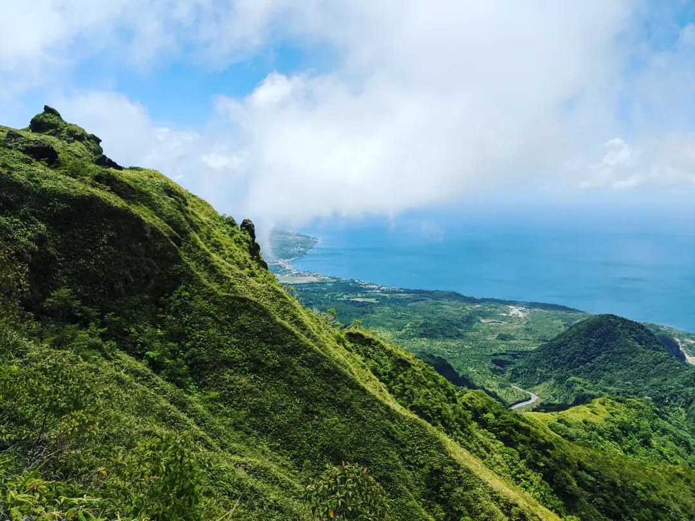
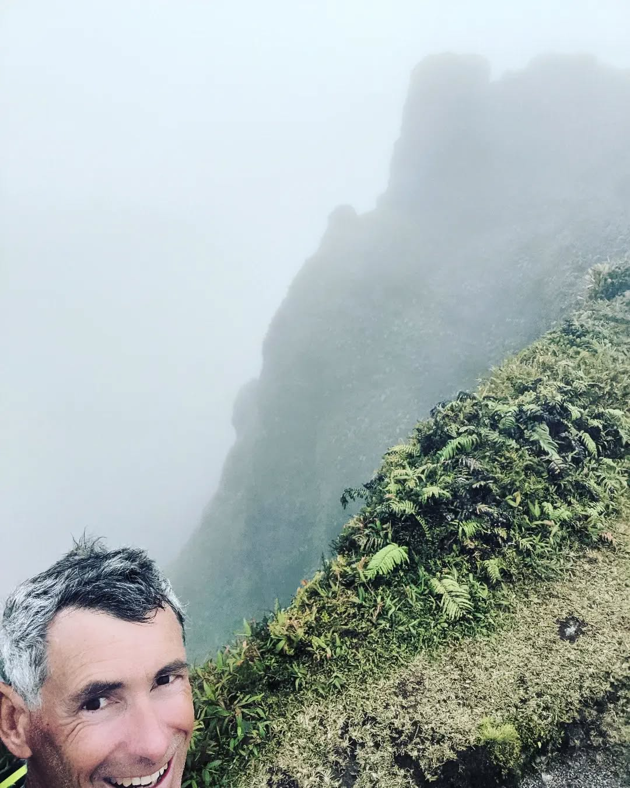
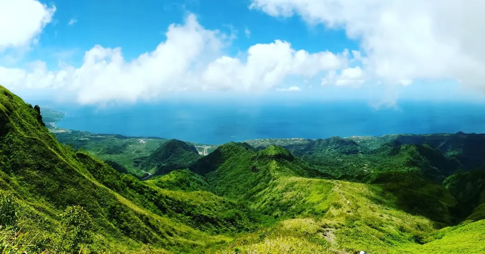
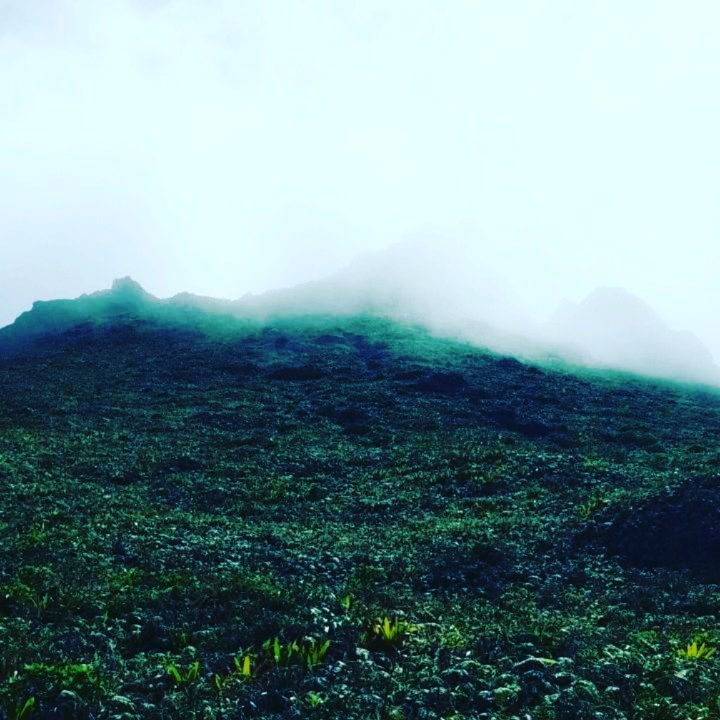
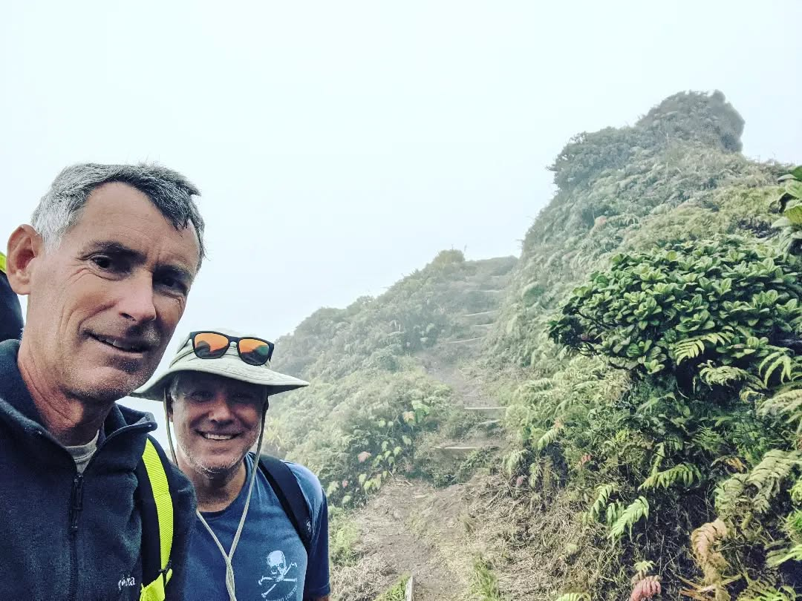

<video src="2023-03-29_16-12-34_UTC_4.mp4" width="100%" controls muted loop playsinline></video>

Sharing a few shots from Monday's hike up Mount Pelee. It's about 4500 ft and usually shrouded in clouds. We took the bus from St Pierre to Mourne Rouge and hiked up from there. Then hiked down all the way to Le Precheur (sea level) and bussed back to St Pierre from there. I don't recommend that Precheur route. Too long and too hot. Awesome hike though and nice and cool at the rim of the caldera, crater, and peaks within.  #calypsosailsagain #montagnepelée #martinique
