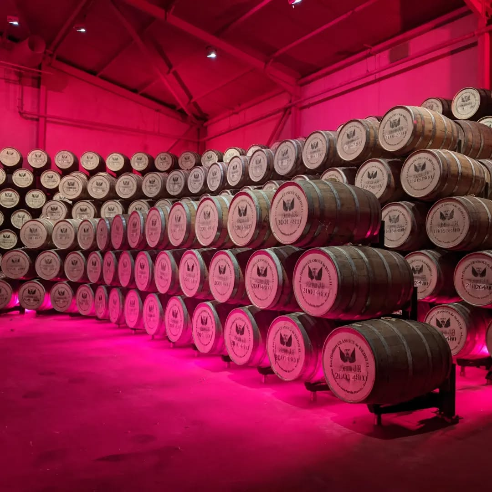
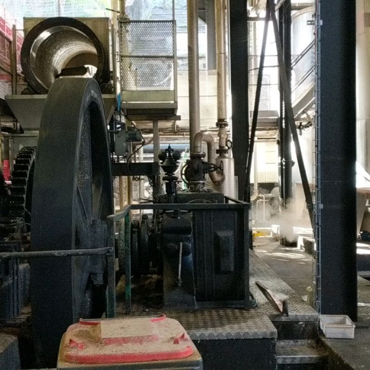
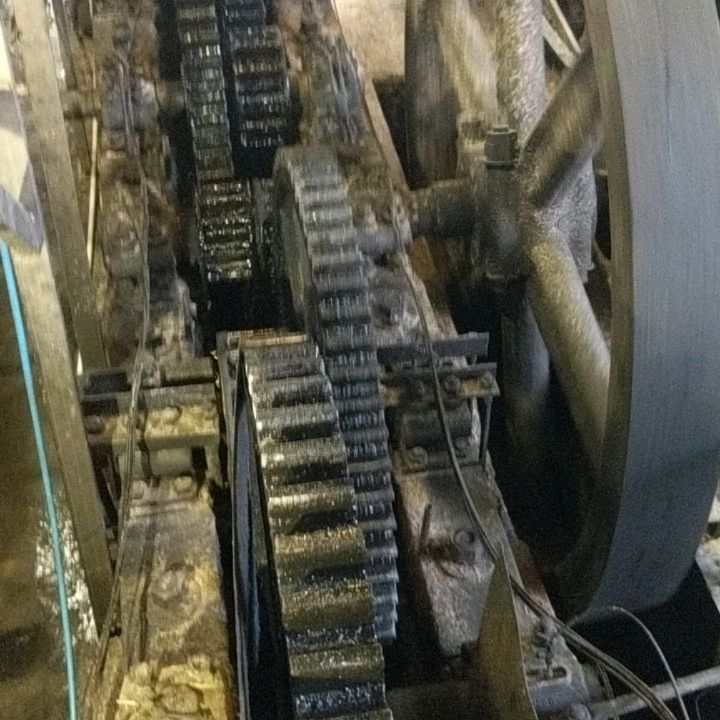

<video src="2023-04-09_22-59-58_UTC_2.mp4" width="100%" controls muted loop playsinline></video>

<video src="2023-04-09_22-59-58_UTC_3.mp4" width="100%" controls muted loop playsinline></video>

<video src="2023-04-09_22-59-58_UTC_4.mp4" width="100%" controls muted loop playsinline></video>

Our time in Martinique and the Caribbean is slowly drawing to a close. But super enjoyed touring Rhum  distilleries with friends from Enki while here in Martinique. Here are a few shots of the Rhum J.M distillery. I love these small _working_ distilleries where you are free to crawl through the operating facility!
