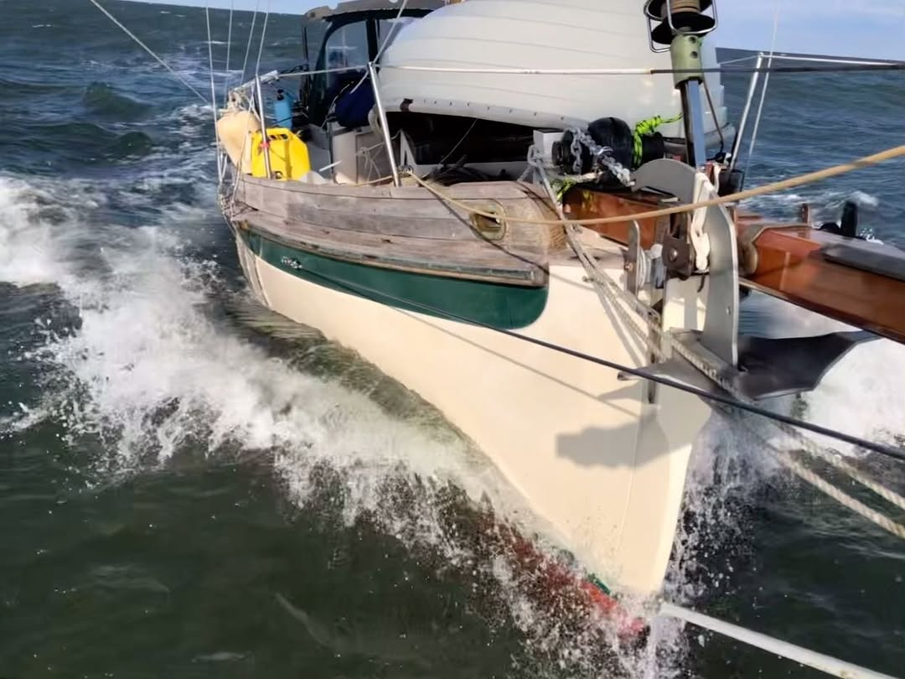

<video src="2023-11-20_14-54-34_UTC.mp4" width="100%" controls muted loop playsinline></video>

@sailingmischiefbcc down the Chesapeake a few days ago. 20-25 kn on the tail. One reef in the main and poled jib wing on wing. Monitor steering. A lot of 7-8 kn with very occasional surfs to 9+ kn.  #bristolchannelcutter
