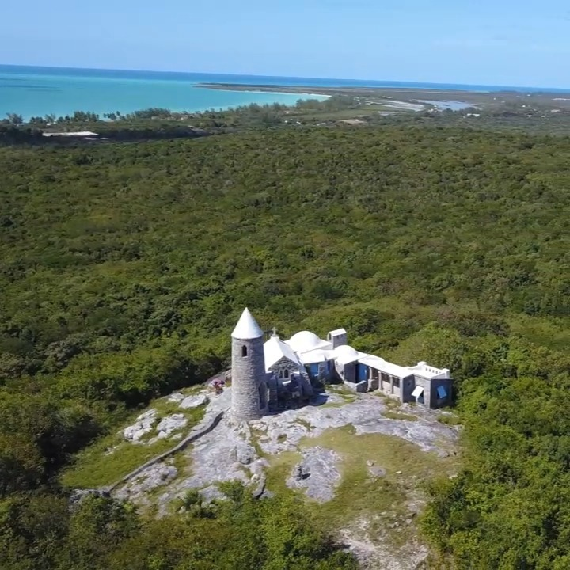

<video src="2024-02-19_23-04-48_UTC.mp4" width="100%" controls muted loop playsinline></video>

Touring "The Hermitage" atop Mount Alvernia - Cat Island, Bahamas. It's a festinating site. A small scale reproduction of a European monastery built by a retired priest. Mount Alvernia is the tallest point in the Bahamas - at 204 ft.
