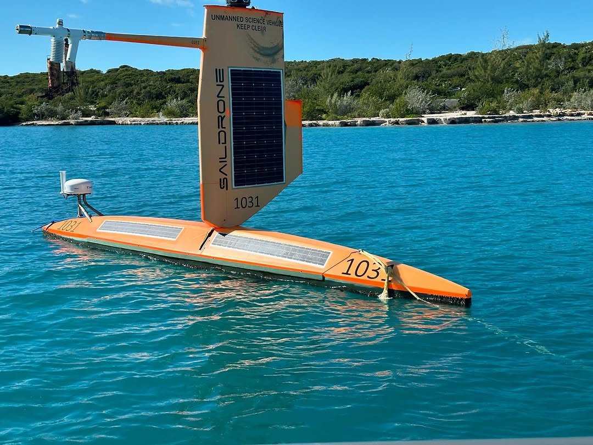
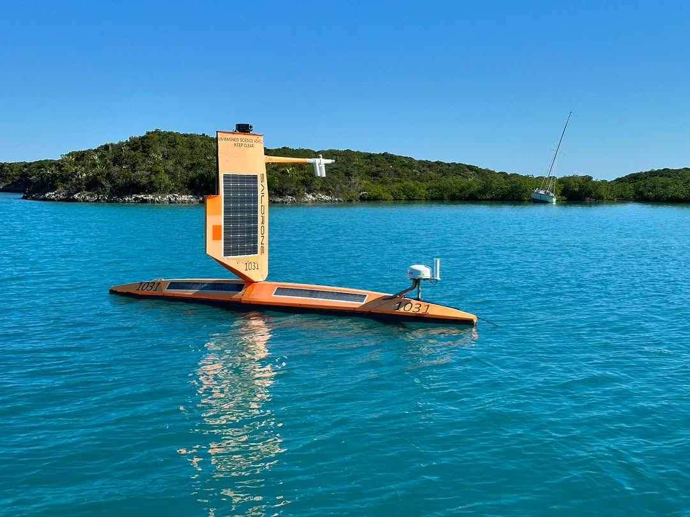
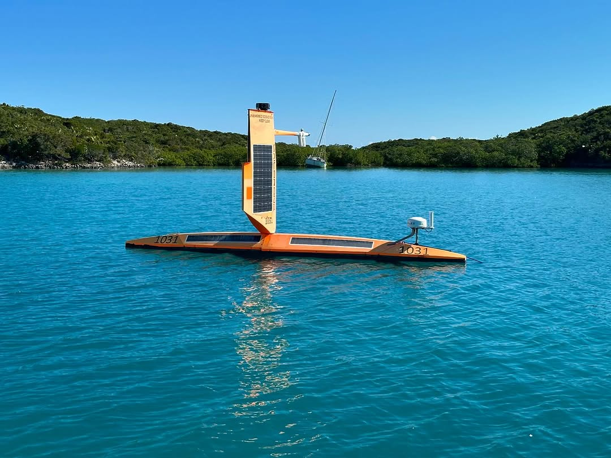
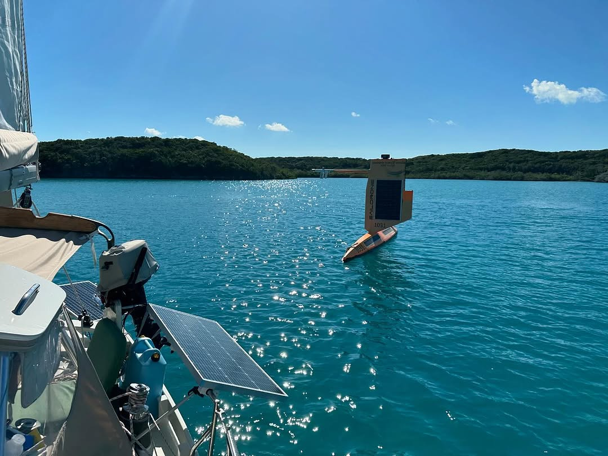

Found a @saildrone (SD 1031) on our lazy sail around Elizabeth Harbour, Exuma this morning. Anchored by Crab Cay. Putting out good AIS signal. She looks a little worse for the wear. Perhaps missing a trailing edge flap on the rigid wing sail and/or some mast head instrument or antenna.
