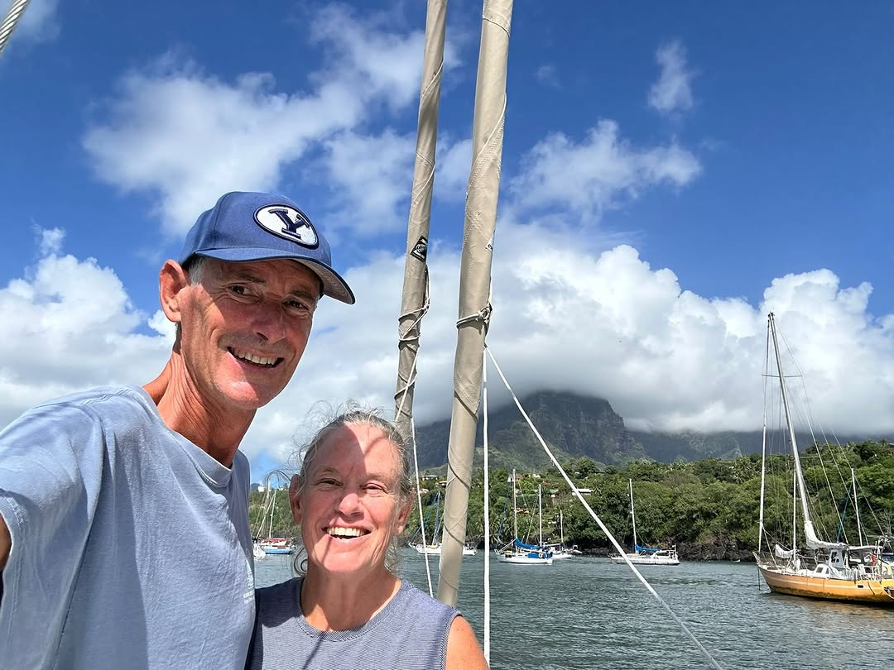

Calypso Chronicles Day 33 - "LAND HO!! LAND HO LAND HO LAND HO!!!" 🏝️

After a 4,222 nautical mile passage from Panama, s/v Calypso is safely anchored in Hiva Oa, Marquesas, French Polynesia. 

Congratulations to The Boat Galley's @nicawaters  and @jaffadog2  on a safe and FAST passage across the Pacific! We've loved cheering for you on this grand adventure.  Thanks for bringing all of us along for the journey. 

Now drink that bottle of champagne and enjoy your amazing accomplishment! 🍾🥂

 #boatlife #cruisinglife #lifeafloat #lifeonthewater #liveaboard #liveaboardlife #livingaboard #livingonaboat #sailboatcruisers #sailboatcruising #sailboatlife #sailingadventure #sailingboat #sailinglife #sailinglifestyle #betterboatlife #makingboatlifebetter
