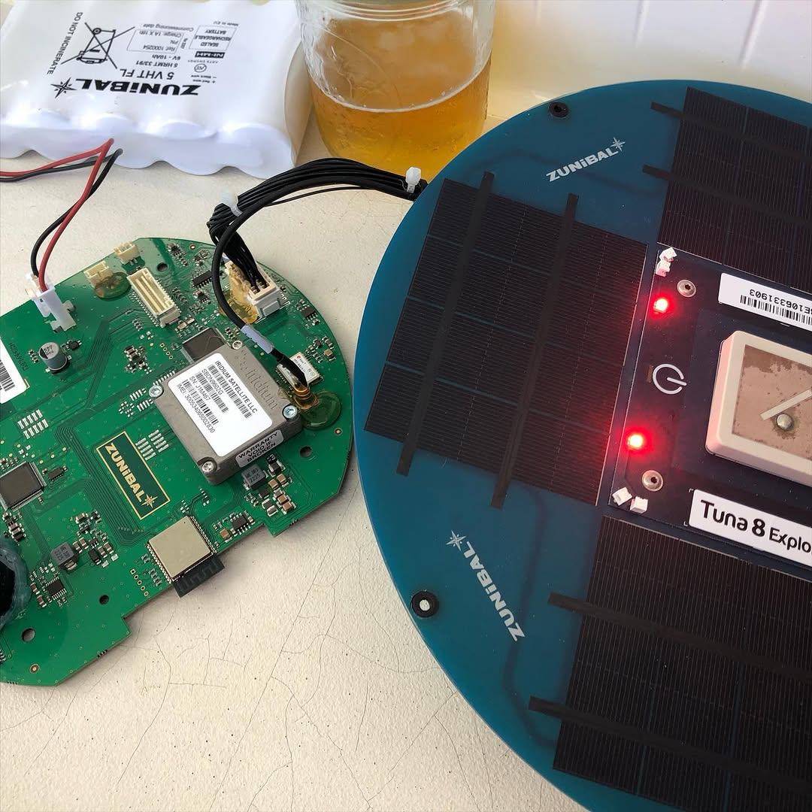
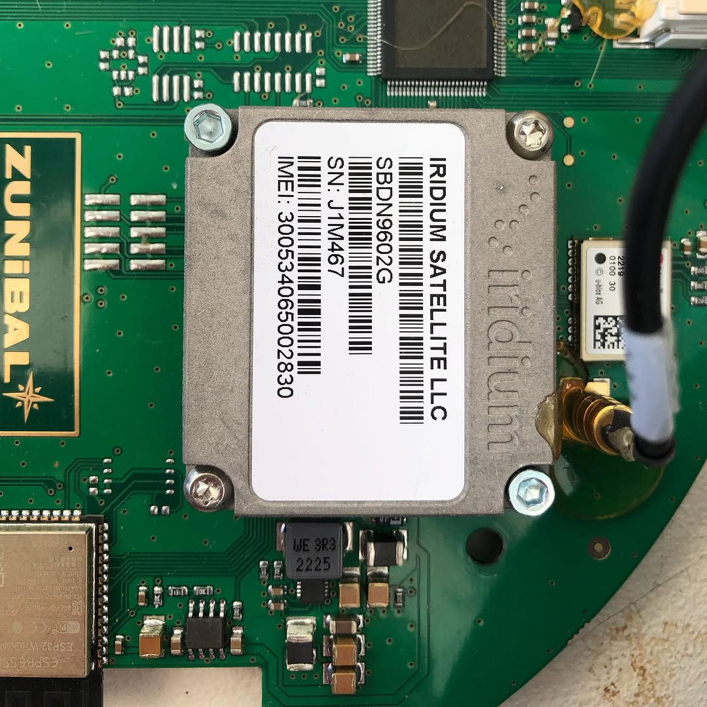
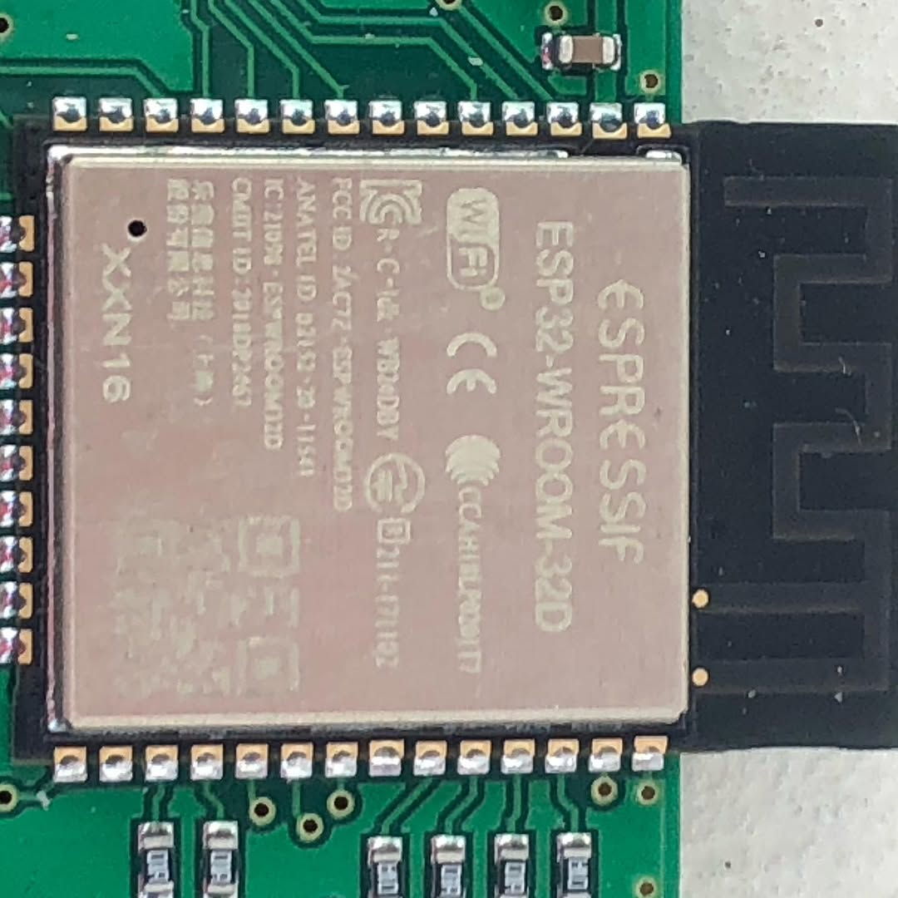
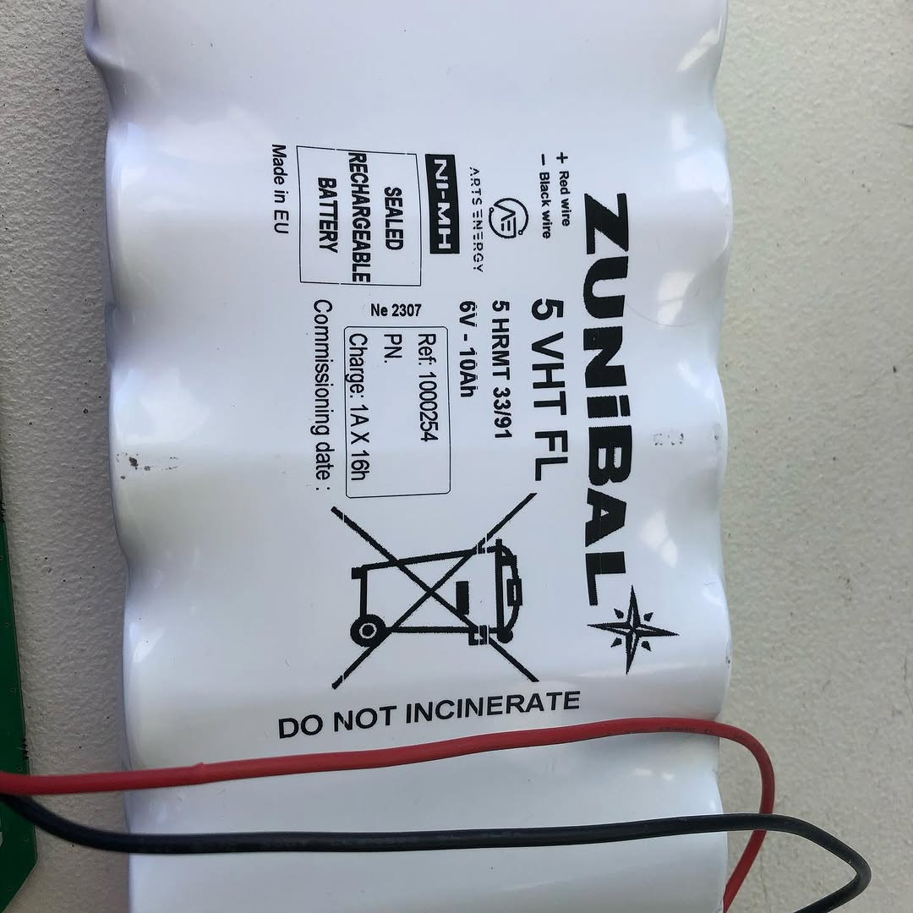

Belated follow up on the #zunibal #tuna8explorer FAD I found. Here’s the tear down. It’s single board. Pretty good build quality. 2 mystery microcontrollers appear to have been etched to remove makers marks. A nice #iridium 9602 module and ceramic patch antenna. A #blox NEO-M8J GPS receiver which shares the same antenna. A mystery #expressif ESP32 MCU/Wi-Fi. Wi-Fi is not called out as a feature by #Zunibal. A hefty NiMH battery. An #airmar P7 transducer. It charged up and fires up just fine. It uses a magnetic reef switch for on/off. I’m guessing it phones home and then goes stealth dark, despite still being on. Even after sundown, the LEDs that would help prevent collisions do not fire up. Maybe the previous owner configured it for stealth. Or maybe that’s default behavior for units that have been deregistered. Anyway… what interesting things could I do with this?  Was thinking of using the solar cells and battery to at least fashion a Franken-cockpit-light. Any other ideas? In our next episode, we tear down a #satlink triton supercap FAD which takes an entirely different design approach… stay tuned. BTW if any manufacturers want to do some low cost oppo-research, DM me 🫡
