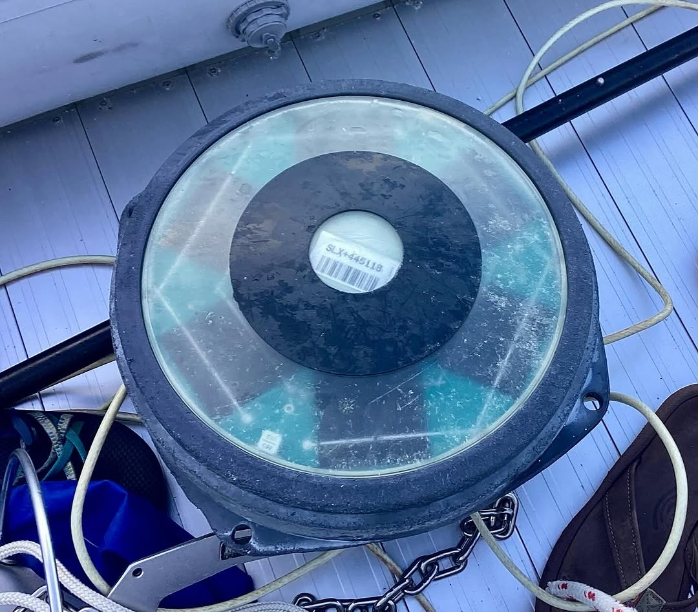
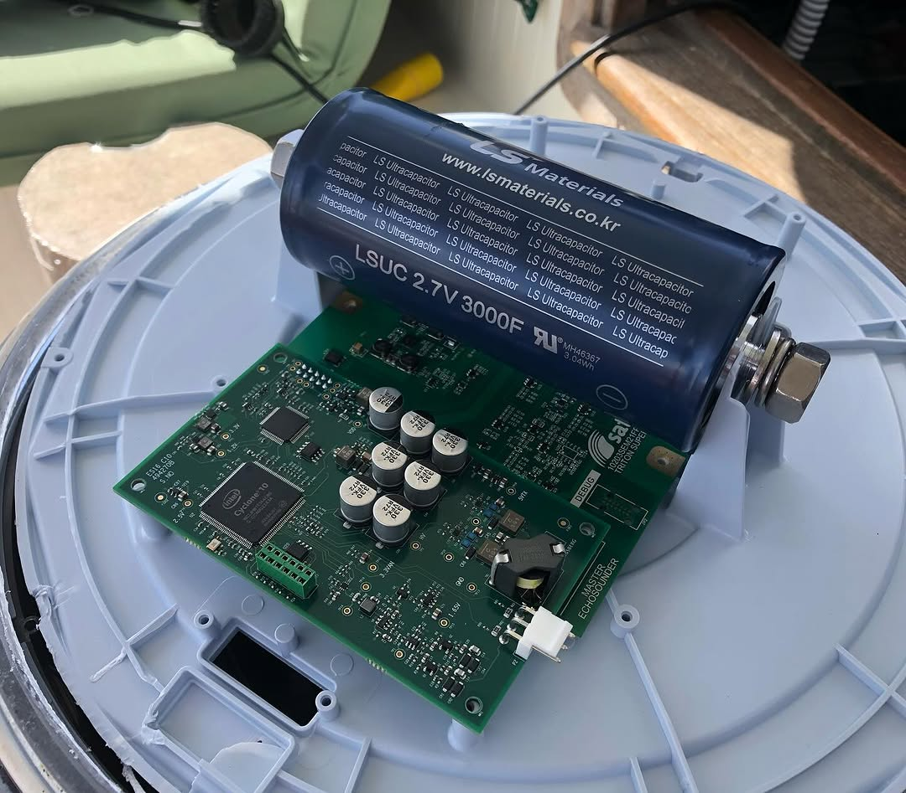
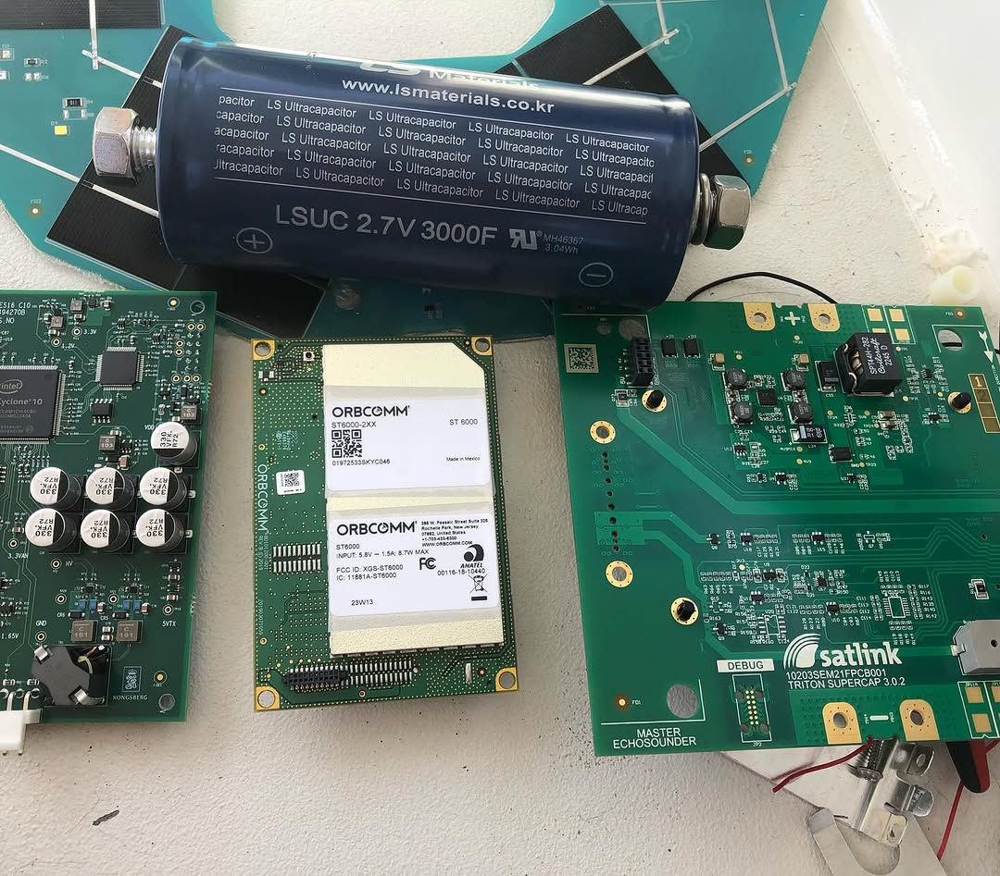

In our second episode of FAD buoy tear downs, we have a @satlinksl SLX+. First impression is that this is a lower cost build than the #zunibal #tuna8. Satcom is provided by @orbcomm. It uses a @kongsbergmaritime transducer and daughterboard to process soundings. Concrete ballast. But the nifty variation here is that they use a #lsmaterials #supercapacitor to power the unit. This is touted as environmentally friendly 🙄(no battery chemicals), but plastic junk #flotsam washed up on a reef is still crappy unwelcome plastic junk on a reef. Big thank you to all the commercial fishing operators and manufacturers for delivering so much plastic trash to the reefs of the #tuamotu atolls. Can we STOP calling this “eco” or environmentally friendly? 🤔. Now, how do I make an LED cockpit light using this monster capacitor?
