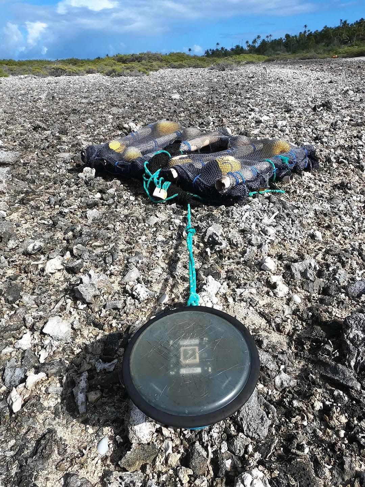
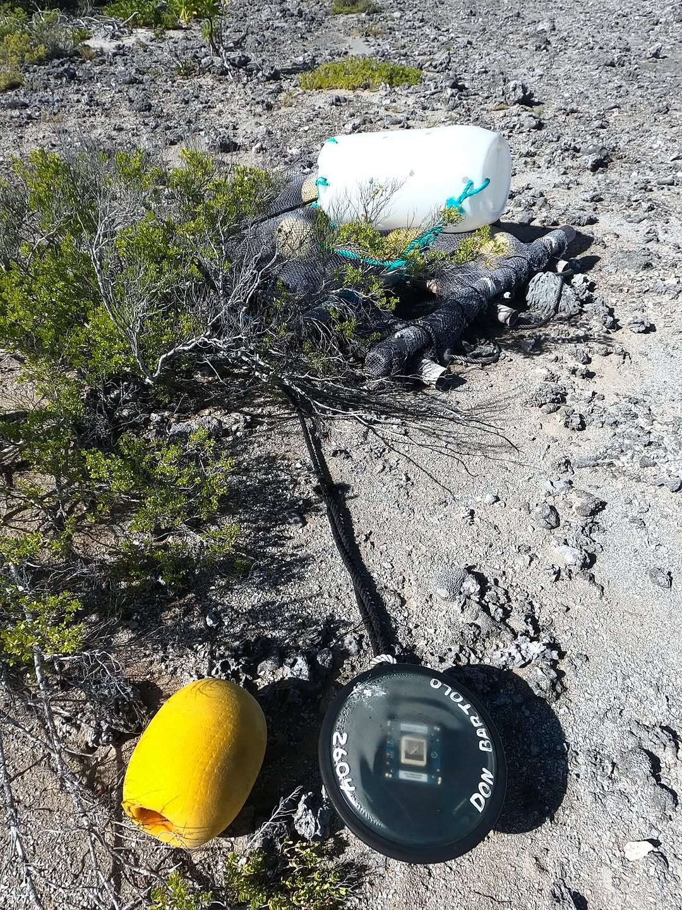
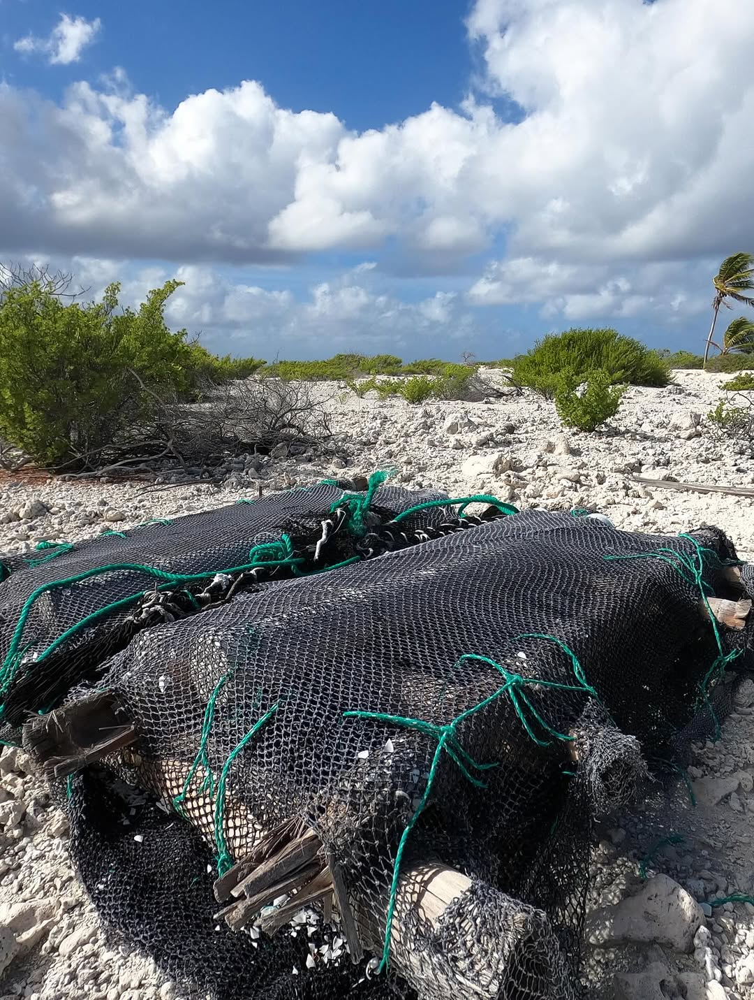
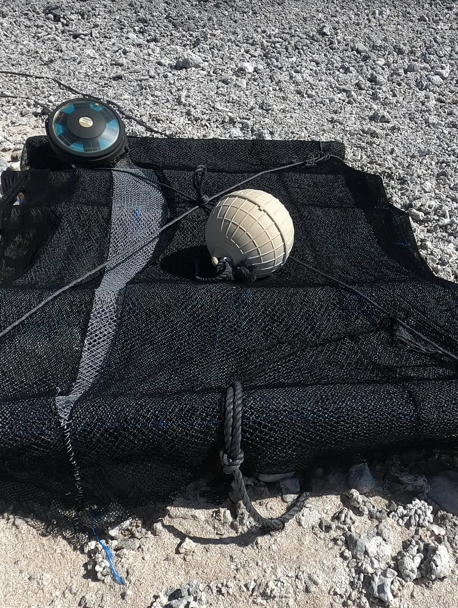
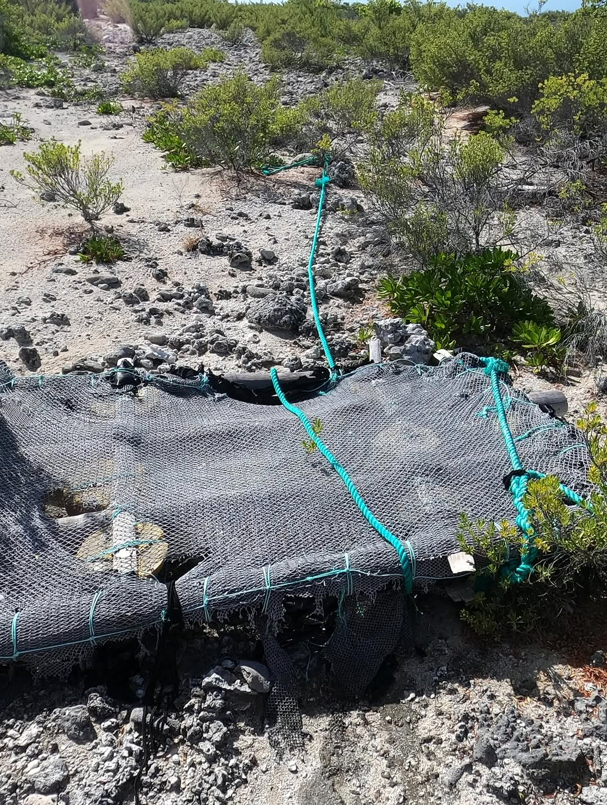
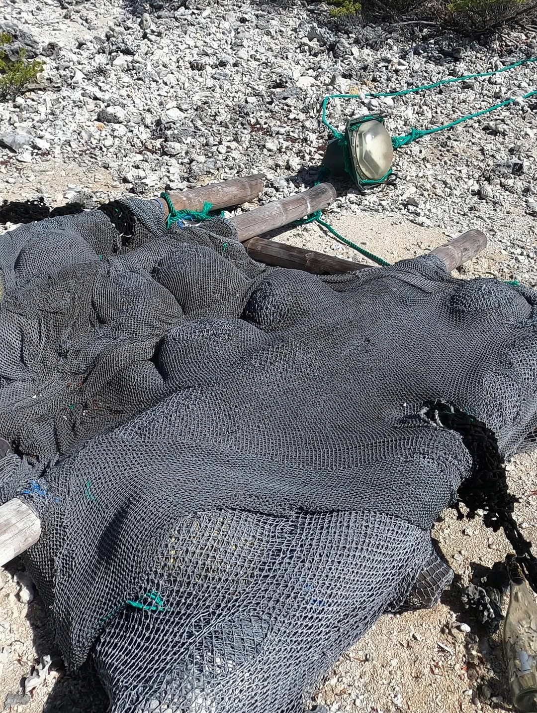

On my morning walk yesterday, I came across more than a half dozen FAD rafts, many still attached to their satellite echo sounder buoy. I’d always assumed these were coming from the Chinese 🇨🇳fishing fleet stationed between #galapagosislands 🇪🇨and #frenchpolynesia🇵🇫 (100s of fishing vessels on station). But a bit of research led me to a @pewtrusts study that reveals #ecuador 🇪🇨 is by far the most likely culprit. Indeed, many of the rafts I’ve found use PVC pipe in their construction, and the pipe end caps have Ecuadorean manufacturers markings. Ecuador is the global leader in drifting FAD use - over 13,000 deployed in 2013 alone. I wonder what that number looks like now. These buoys are all manufactured by Spanish 🇪🇸 companies (#marineinstruments #satlinkSL #zunibal) and use their echo sounder to determine the tuna concentration under the FAD, and then report that to the mother ship by sat link. The mothership can then focus fishing efforts on the most productive FAD buoys. When the cost of fuel or opportunity cost exceeds the cost of retrieving a non productive buoy ($600-1500), they simply abandon it and let it wash up on someone else’s shore to clean up. It’s paradoxical that Ecuador can be so righteous about maintaining the ecology of the Galapagos while taking a huge dump 💩 on the rest of the Pacific.
