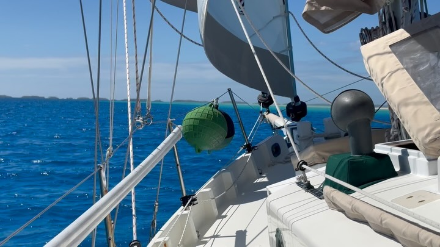
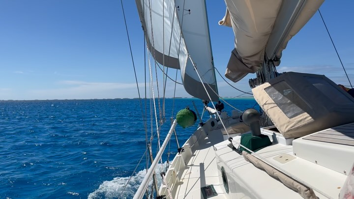
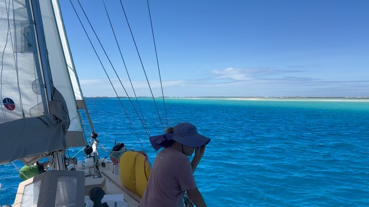
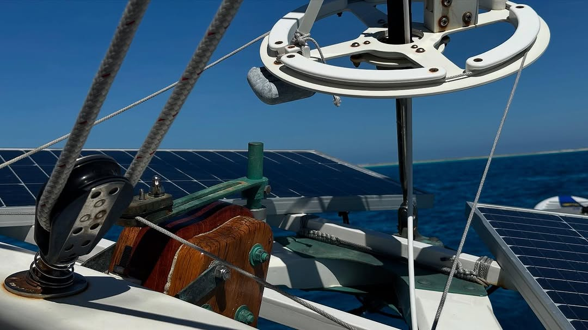
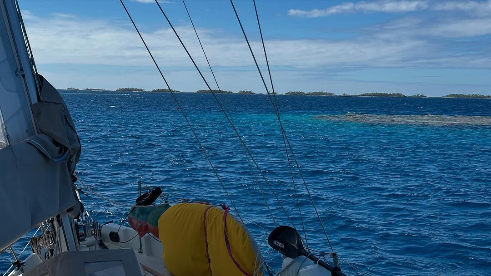

<video src="2025-07-28_03-56-40_UTC_1.mp4" width="100%" controls muted loop playsinline></video>

<video src="2025-07-28_03-56-40_UTC_2.mp4" width="100%" controls muted loop playsinline></video>

<video src="2025-07-28_03-56-40_UTC_3.mp4" width="100%" controls muted loop playsinline></video>

BCC Calypso sailing up to the Eastern end of Makemo today. Nice flat water sailing. Lots of bommies and keel grabbers to dodge. “Larry”, our trusty Freehand steering the whole way handling the shifty winds 👍. #calypsosailsagain #bristolchannelcutter #makemo #frenchpolynesia🇵🇫 #bommies #freehand #sailing
