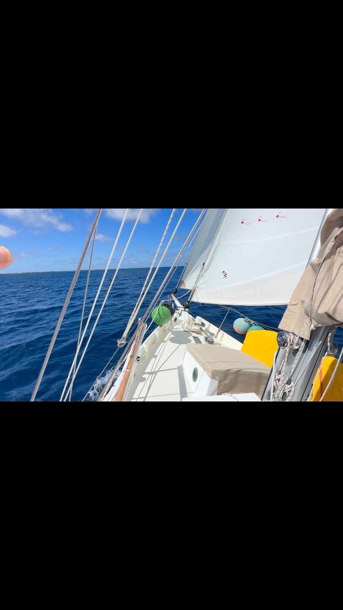

<video src="2025-08-06_06-20-55_UTC.mp4" width="100%" controls muted loop playsinline></video>

BCC Calypso gliding up to the East end of the Katiu lagoon (Tuamotu Archipeligo, French Polynesia). “Larry”, our trusty Freehand windvane handling the heavy work of playing the wind shifts 💪. We have the whole lagoon to ourselves - no other boats here 🤷. #calypsosailsagain #bristolchannelcutter #frenchpolynesia🇵🇫 #tuamotu #katiu #sailing #freehandselfsteering
