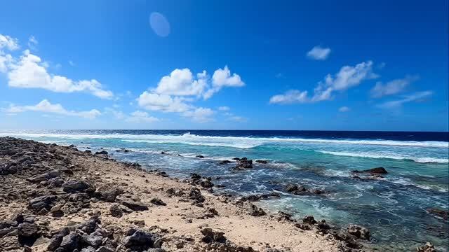

<video src="2025-08-06_22-47-11_UTC.mp4" width="100%" controls muted loop playsinline></video>

Morning walk along the coral berm on the east end of the Katiu atoll. The berm is coral rubble formed by thousands of years of Pacific Ocean storm waves bashing and breaking the coral reef and tossing the bits inshore. Further inshore, the gray luner landscape is a plain of sunburned coral rubble. Calypso is anchored in the calm lagoon waters behind the tree line you see at the end of the camera pan. #katiu #tuamotu #frenchpolynesia🇵🇫 #atoll #reef #pacificocean #motu #hoa #crazypowerfulocean #calypsosailsagain
