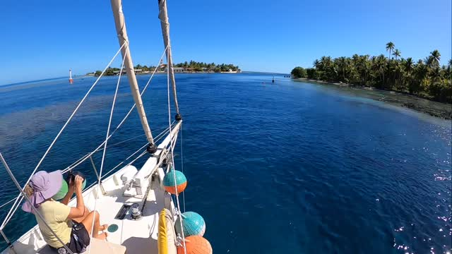

<video src="2025-08-16_20-29-48_UTC.mp4" width="100%" controls muted loop playsinline></video>

BCC Calypso headed out Passe Pakata, Katiu on this morning’s high tide slack. 🪸Reef to starboard and reef to port 🪸. Not sure where we’re headed. Not much wind 🤷‍♂️💨 🏝️#calypsosailsagain #katiu #tuamotu #frenchpolynesia🇵🇫
