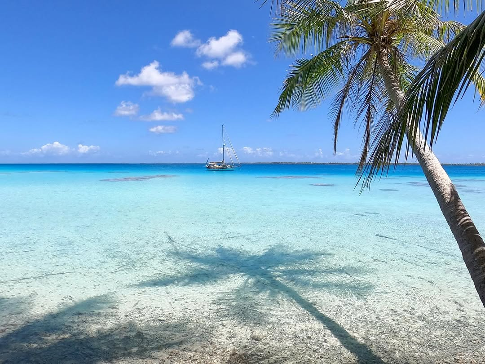
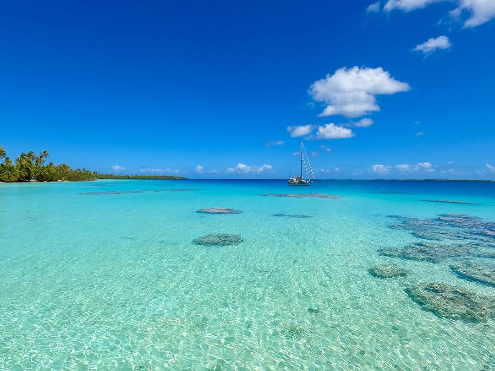
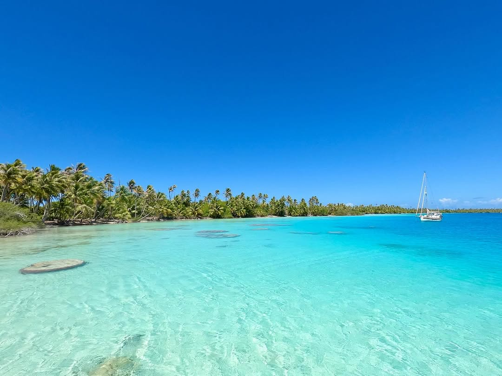

BCC Calypso visiting Takaroa atoll in the Tuamotu Archipelago. The lagoon used to be home to so many pearl farms that visiting sail boats were not permitted to enter. In 2011-2014 the lagoon suffered an algae bloom event that killed all the oysters and spats. Most farms went belly up and walked away. Today lots of abandoned pearl farming gear still litters the lagoon and its banks. Some abandoned pearl farms are like ghost towns. Lots of equipment left abandoned. Cloths and VCR tapes on the shelves. Bills, receipts, and employment records in binders in the office. #calypsosailsagain #takaroa #tuamotu #frenchpolynesia🇵🇫 #pearlfarm #atoll #lagoons
