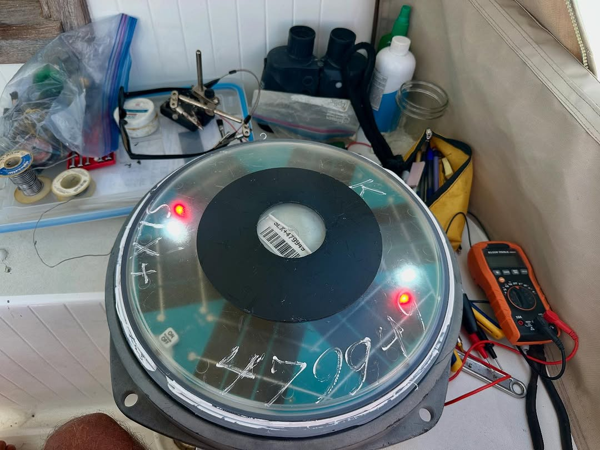
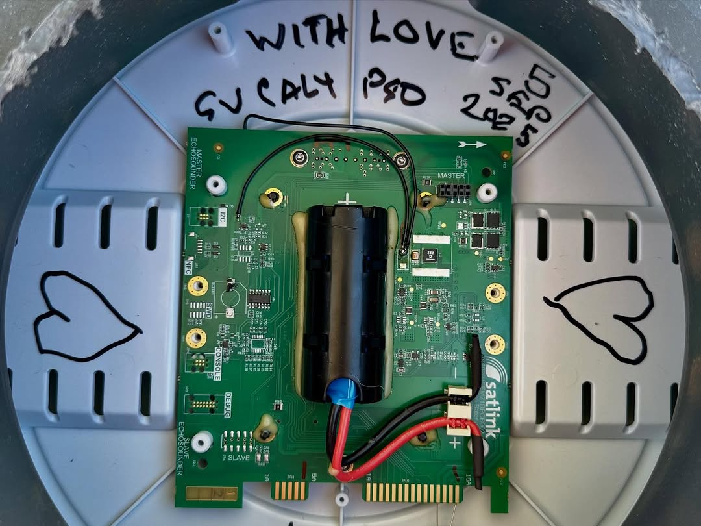

It’s another great day to convert a washed up FAD buoy into a solar lantern. This one is a #satlinksl SLX+ non-“eco”, so it has a rechargeable battery rather than a super capacitor. I buttotomized it, yanked the sonar board and orbcomm board, added a couple jumpers to power up the LEDs, and voila! Gifted to a copra shack on the SE end of Kauehi. #calypsosailsagain #kauehi #tuamotu #frenchpolynesia🇵🇫 #fadbouys #recycle
