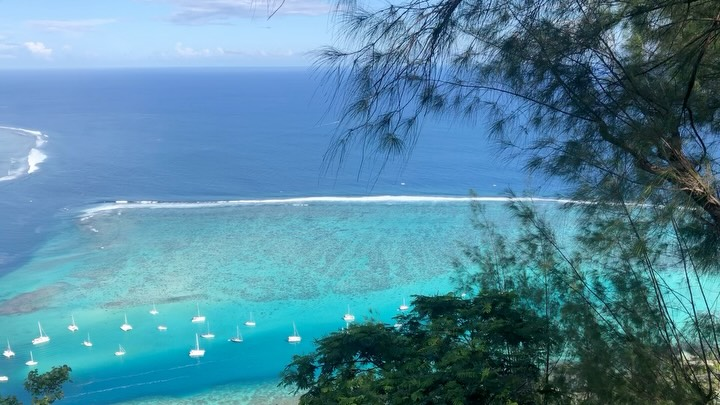
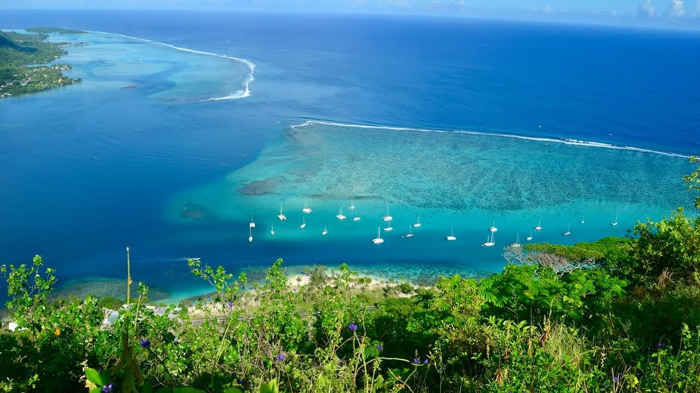
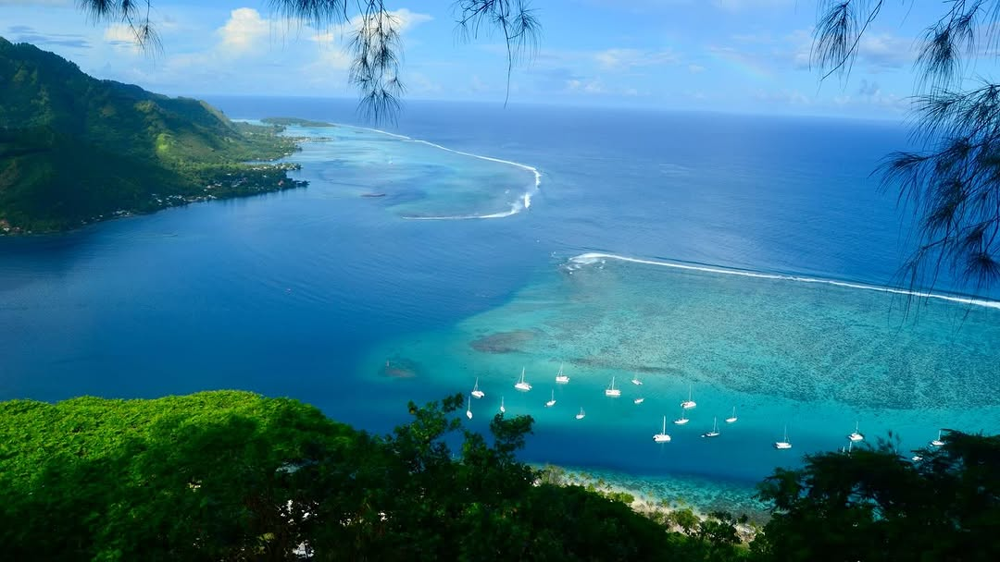
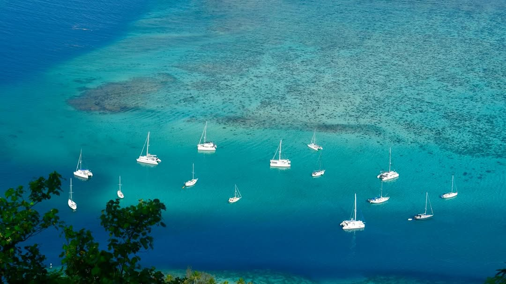

<video src="2026-01-04_21-54-06_UTC_1.mp4" width="100%" controls muted loop playsinline></video>

Morning hike up the slopes of Mount Rotui, Moorea. I stopped at almost 300m elevation where an outcrop of trees and a bare ridge provided some spectacular views across Opunohu Bay. Poorly maintained trail - not enough traffic. Brush thick and tall enough that you can’t see your feet for much of it. Some ropes in the steep parts. From here, the trail continues along a very sharp/steep ridge to the peak which is about 920m elevation (which I did not do). #moorea #opunohu #montrotui #rotui #polynesiefrancaise sailboatsarenottheboogieman lesvoilierssonsbon
