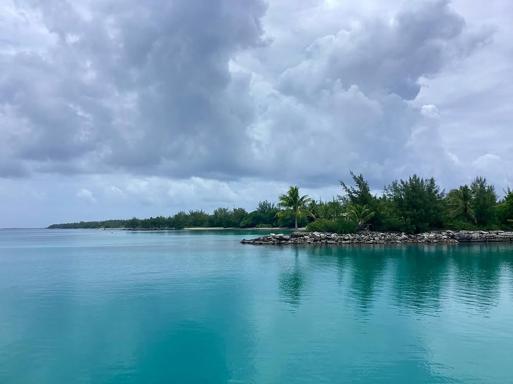

Arrived back in Hao (Haorangi) in the Eastern Tuamotus early this morning. Quite a boisterous sail down from Makemo through persistently troughy conditions. Very gusty - lots of rain squalls - and an uncountable number of sailplan changes. Pretty exhausting. Uneventful transit through Passe Kaki, which has a reputation for providing unwelcome excitement. Not a picturesque anchorage, but it is a place with “interesting” history. Hao was the main logistical base supporting French nuclear testing in Mururoa and Fangutaufa. In its hay-day, the military base accommodated 5,000 people. All gone now. Locals say that when the military finally left, the lights literally went out as the military crew managing the power plant shut it down and left. Locals have laid claim to many of the surviving base buildings and turned them into makeshift homes. Today, about a 1,000 people live here. It’s pretty far off the tourist track. I’m looking forward to a few walks around town and comparing impressions to when we were last here in June last year.
