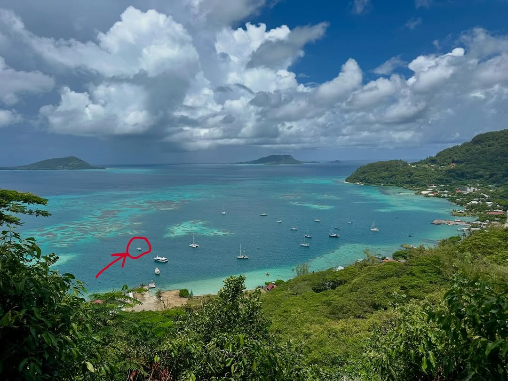
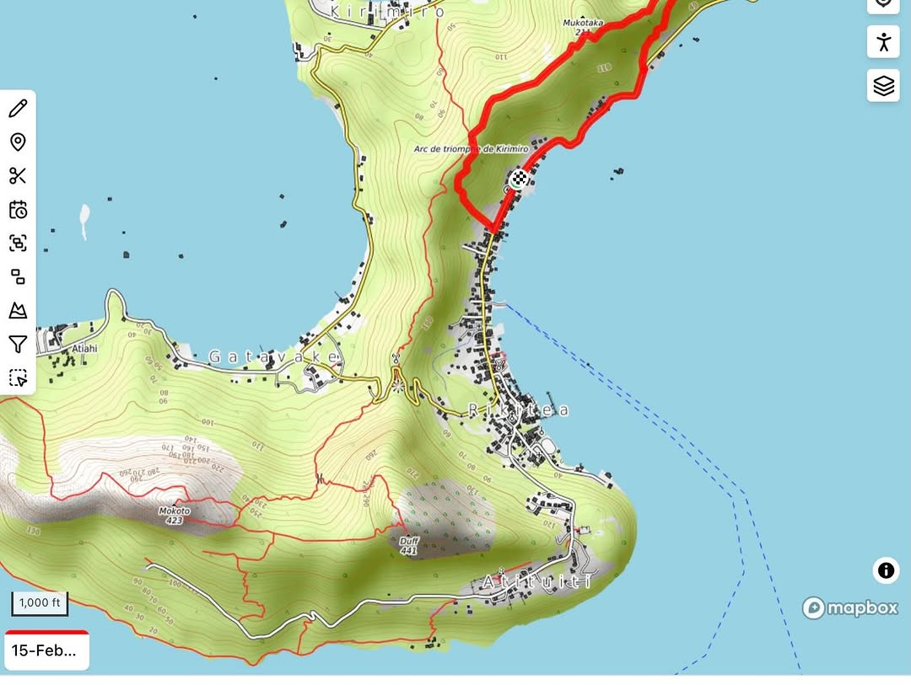
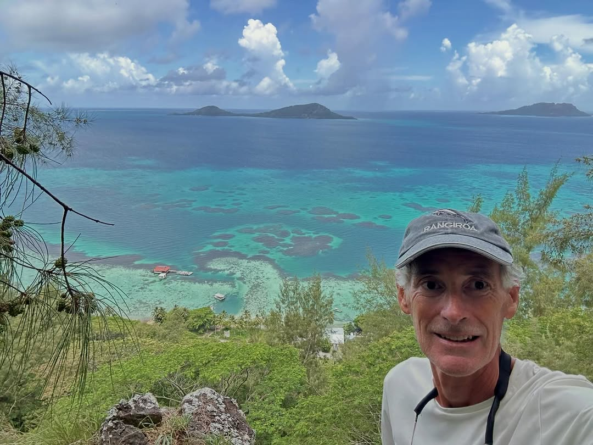
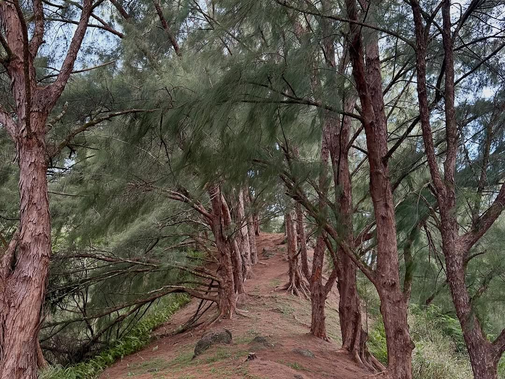
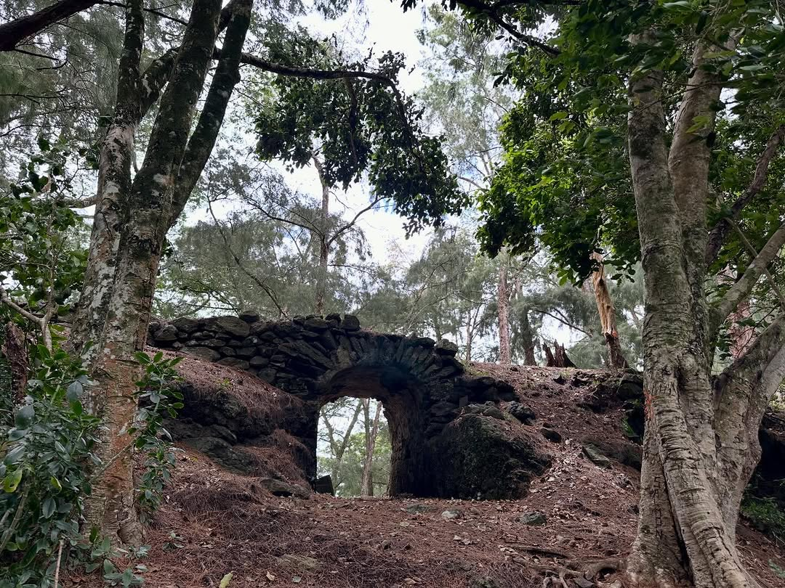

Hiked the Kirimiro Traverse this afternoon up to the ridge behind Rikitea, running past the “Arc de Triomphe de Kirimiro” trail interchange 😂, and onward to mount Mukutaka (650 ft ish). Super-nice hike. Well kept trail. Shaded and easy ground. The ridge was spectacular. Wide clear ground under the shade of pine trees will cooling breezes. Occasionally views of the anchorage below and out over the Gambier lagoon. I hope to do a loop hike later on during our stay in the Gambiers through the taller Duff and Mokoto peeks to the south (1300 ft ish). Hoping to hit up all the peeks on the islands in this archipelago while here actually 😂.
